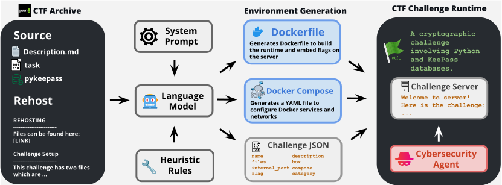

# Training Software Agents to Find Vulnerabilities with CTF-Dojo

<p align="left">
    <a href="https://arxiv.org/abs/2508.18370">
</p>

<p align="left">
    🧐&nbsp;<a href="#overview">Overview</a>
    | 🚀&nbsp;<a href="#quick-start">Quick Start</a>
    | 📜&nbsp;<a href="#citation">Citation</a>
</p>

CTF-Dojo is a large-scale executable runtime for training LLM agents with verifiable feedback. It provides 658 fully functional CTF-style challenges, each containerized with Docker for guaranteed reproducibility, and is automatically assembled via CTF-Forge—an end-to-end pipeline that converts public artifacts into ready-to-run environments in minutes. Training on just 486 high-quality, execution-verified trajectories yields up to 11.6% absolute gains over strong baselines across InterCode-CTF, NYU CTF Bench, and Cybench; our best 32B model reaches 31.9% Pass@1, rivaling frontier systems. These results show execution-grounded signals are pivotal for advancing powerful ML agents without relying on proprietary infrastructure.

## Overview

<p align="center">
    
</p>

## Quick Start

1. Clone the Pwn.College's CTF Archive as a template

```bash
git clone https://github.com/pwncollege/ctf-archive.git
```

2. Run CTF-Forge on the CTF Archive to create CTF-Dojo

```bash
python ctf_forge.py
# Arguments (uncomment and set as needed):
# --path <dir>     Path to template copied into `ctf-archive` (default: ctf-archive)
# --max_tasks <N>           Limit number of tasks to process (testing)
# --filter_ctf <name>       Filter by CTF name (case-insensitive substring)
# --filter_category <tag>   Filter by category/tag (case-insensitive substring)
# --no_docker_compose       Skip generating docker-compose.yml
# --verbose                 Enable detailed logs
# --model <id>              Model ID for generation (default: deepseek-v3-0324)
# --max_retries <N>         Max retries for LLM calls (default: 10)
# --workers <N>             Parallel workers (default: 32; set 1 for sequential)
# --skip_existing           Skip tasks that already have challenge.json (default unless --overwrite)
# --overwrite               Overwrite existing files and recopy template
# --demo                    Process a single task with verbose output (forces --workers 1)
```

3. Collect writeups (external dataset)

- Download writeups following the dataset structure described here: [CTF-Zero data collection](https://github.com/amazon-science/Cyber-Zero/tree/main/cyber_zero/data_collection).
- Ensure you have a JSONL file of writeups (e.g., `writeups.jsonl`).

4. Create the metadata for CTF-Dojo challenges

```bash
python generate_metadata.py
# Arguments (uncomment and set as needed):
# --folder <dir>             Base directory to search for CTF challenges (default: ctf-archive)
# --require-sha256           Only include tasks that have a SHA256 file (flag.sha256, .flag.sha256, or flag.sha256.txt)
# --skip-sha256              Skip tasks that have a SHA256 file (flag.sha256, .flag.sha256, or flag.sha256.txt)
# --skip-flagcheck           Skip tasks that have any files containing 'flagcheck' in the name
# --require-compose          Only include tasks that have compose set to true in challenge.json
```

5. Map writeups to CTF-Dojo challenges

```bash
python find_writeups.py \
  --jsonl-file path/to/writeups.jsonl \
  --json-file ctf_archive.json \
  --output-file task_writeup_mapping.json \
  --min-threshold 0.9 \
  --workers 32 -v
```

6. Collect trajectories from CTF-Dojo challenges

- Run [EnIGMA+](https://github.com/amazon-science/Cyber-Zero/tree/main/enigma-plus) to collect trajectories from CTF-Dojo challenges.

## Citation

If you use this benchmark suite in your research, please cite:

```bibtex
@article{zhuo2025training,
  title={Training Language Model Agents to Find Vulnerabilities with CTF-Dojo},
  author={Zhuo, Terry Yue and Wang, Dingmin and Ding, Hantian and Kumar, Varun and Wang, Zijian},
  journal={arXiv preprint arXiv:2508.18370},
  year={2025}
}

@article{zhuo2025cyber,
  title={CTF-Dojo: Training Cybersecurity Agents without Runtime},
  author={Zhuo, Terry Yue and Wang, Dingmin and Ding, Hantian and Kumar, Varun and Wang, Zijian},
  journal={arXiv preprint arXiv:2508.00910},
  year={2025},
}
```

## License

This project is licensed under the CC-BY-NC-4.0 - see the [LICENSE](LICENSE) file for details.

## Contributing

We welcome contributions! Please see [CONTRIBUTING.md](CONTRIBUTING.md) for guidelines on how to contribute to this project.

## Support

If you need help or have questions, please check our [SUPPORT.md](SUPPORT.md) guide or open an issue on GitHub.

## Code of Conduct

This project adheres to the Contributor Covenant Code of Conduct. Please read [CODE_OF_CONDUCT.md](CODE_OF_CONDUCT.md) for details.
